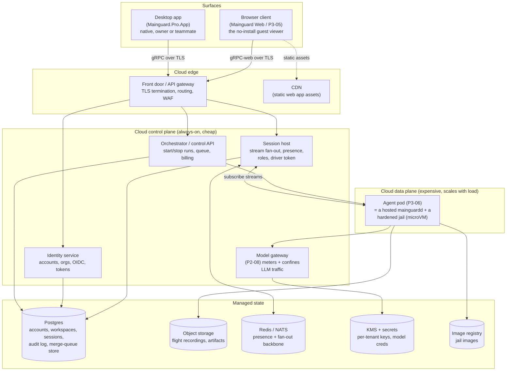

# Collaborative agent sessions — full system architecture

Status: **design / planning** (no code) · Companion to [`collaborative-sessions.md`](collaborative-sessions.md)
(the locked product decisions) — this doc is the **end-to-end system architecture**: how the desktop
app, the browser client, and the cloud backend are built, wired together, hosted, and paid for. It is
written to be read by someone who has **not built a large cloud backend before**, so it explains the
cloud primitives, not just Mainguard's use of them.

> This concretizes **P3-10** beyond its deliberately-thin v1 (which skipped "real-time multiplayer" —
> that skip is precisely what this fills) and stacks on **P2-23** (OIDC identity/RBAC), **P2-32**
> (gRPC + gRPC-web SDK), **P2-41** (device pairing, scoped tokens, SPA hosting — the *single-viewer*
> precursor), **P3-06** (cloud tenant store + "cloud pods" — where jails run), **P3-05** (Mainguard
> Web), **P2-45** (flight recorder), **P2-15** (tamper-evident audit).

---

## Part 1 — The one idea everything follows from

**The daemon is already a server.** On your machine today, `mainguardd` runs the agent's jail, owns
every stream (agent events, the merge queue, the terminal PTY, the flagged-change gate, the merge
lease), and serves exactly **one** client — the app — over a loopback socket with pinned mTLS.

Collaboration needs a *second* person to reach that run. A second person cannot reach a socket on your
laptop. So the run has to live somewhere reachable by many people — **the cloud** — and the daemon
has to serve **many** clients instead of one.

That is the whole architecture in one sentence: **take the daemon you already have, host it in the
cloud, and make it serve N authenticated clients instead of 1 local one.** Almost everything below is
either (a) the plumbing to host a daemon safely for other people's code, or (b) the plumbing to fan
its streams out to many viewers with identity and presence. There is **no new CRDT/merge-conflict
engine** — the run has one terminal input, one merge lease, and idempotent acknowledgments, so the
hard part of Google Docs simply is not present here.

### The two deployment modes the same app must handle

The desktop app must work in both, ideally without the user thinking about it:

| | **Local mode** (today, free) | **Cloud mode** (new, paid) |
|---|---|---|
| Where the jail runs | your machine (Mac host / WSL VM) | a hardened sandbox in the cloud |
| Where the daemon runs | your machine | the cloud |
| How the app connects | loopback `127.0.0.1:5250`, pinned mTLS | the internet, TLS + your Mainguard account token |
| Who can watch | only you | you + invited teammates |
| Git source of truth | your local checkout | **still a human's checkout** (see Part 5) |

The elegance: **it is the same wire contract** (the P2-32 gRPC/gRPC-web protocol). Local mode dials a
socket; cloud mode dials a URL. The app already talks to `DaemonBackedOrchestrator`; in cloud mode
that adapter points at the cloud endpoint instead of loopback. This is why the on-prem product and
the cloud product are not two codebases — they are one client against one protocol, over two
transports.

---

## Part 2 — The whole system at a glance

Three "surfaces" (things a human touches) and one backend (things they don't):

Read it as: **surfaces** connect through the **edge** to a small **control plane** (always running,
cheap — auth, session fan-out, orchestration, model gateway) which manages a large, elastic **data
plane** (the actual agent pods — the expensive part that scales with how many agents are running),
all backed by **managed state stores**.

---

## Part 3 — The cloud backend, component by component (the new-to-you part)

If you have only ever shipped a desktop app, "the backend" is a fog. Here is every box, what it is,
why it exists, and a concrete recommendation for a small team. **The recurring theme: prefer managed
services over self-hosting; you are building a product, not an ops team.**

### 3.1 The front door (edge)
**What it is:** the single public entry point. It terminates TLS (holds the HTTPS certificate), routes
each request to the right internal service, and does basic protection (rate limiting, a WAF against
abuse). Nothing internal is exposed to the internet directly — everything is behind this.
**Why it exists:** you want *one* thing facing the internet to secure, and internal services should
never trust the network. It also handles the tricky bit for us: **gRPC-web** (browsers can't speak raw
gRPC/HTTP2 trailers) needs translation, and long-lived streams need WebSocket/HTTP2 upgrade support.
**Recommendation:** a managed load balancer / API gateway with gRPC-web support (e.g. Envoy — which is
what gRPC-web is designed around — fronted by your provider's LB, or a platform like Fly.io / Cloud
Run that does TLS+routing for you). Static web assets go to a **CDN** (Cloudflare/CloudFront) so the
SPA loads fast worldwide and you don't serve JavaScript from your app servers.

### 3.2 Identity service (accounts, orgs, roles) — builds on P2-23
**What it is:** who a user is, which workspaces they belong to, and what role they hold. Issues the
**tokens** every other service checks.
**Why it exists:** collaboration is meaningless without identity — every viewer, every action, every
audit line is "*which human*." P2-23 already chose **OIDC** and a role/permission model; this is where
those live in the cloud.
**Pedagogical warning:** **do not build authentication yourself.** Password hashing, session
management, OAuth flows, MFA, account recovery — this is a swamp of security footguns. Use a managed
auth provider (Clerk, WorkOS, Auth0, or self-hosted Keycloak if you must own it) for *authentication*
(proving who someone is). Build only *authorization* (workspaces, roles, per-repo membership) yourself,
in your own Postgres, because that is your product's domain. WorkOS/Clerk also give you SSO/SCIM later
for enterprise (which is P2-23's own roadmap) essentially for free.
**Data model (Postgres):** `users`, `workspaces`, `memberships(user, workspace, role)`, and later
`repo_maintainers`. A **personal account** is modeled as a workspace of one — so there is one code
path, and "share into a workspace" works the same whether it's your solo space or a 50-person org.

### 3.3 The session host — the heart of collaboration
**What it is:** the stateful service that a client (app or browser) connects to when it opens a shared
session. It subscribes **once** to the agent pod's daemon streams and **fans them out** to every
connected viewer; it tracks **presence** (who's here, where they're looking), enforces **roles** on
every action frame, and mediates the **driver token** (who may type into the terminal).
**Why it's the hard one:** it is *stateful* — it holds live, long-lived connections. A stateless web
API you can run a hundred copies of behind a load balancer and it doesn't matter which one you hit.
A session host holds Alice's open stream, so if Bob connects to a *different* instance, the two
instances must agree on the session's presence and driver state.
**How you make a stateful service scale (the standard pattern, explained):**
- Each *active session* has **one authoritative source**: the agent pod's daemon. The session host is
  a **fan-out proxy** in front of it, not the source of truth for the run.
- Any session-host instance can serve any viewer. When an instance gets its first viewer for session
  S, it opens **one** upstream subscription to S's pod and re-broadcasts to its local viewers.
- **Presence and driver-token state** live in a shared fast store — **Redis** (or NATS) — keyed by
  session id, with a pub/sub channel per session. When Alice's cursor moves, her instance publishes to
  `presence:S`; every instance serving S receives it and pushes to its viewers. When Bob requests the
  driver token, that's a Redis atomic operation on `driver:S` so exactly one holder wins.
- This means you can run **N session-host instances** behind the load balancer and they coordinate
  through Redis — the textbook way to scale real-time (it's how chat/collab apps do it).
**Roles on the wire:** every state-changing frame from a client carries the caller's token; the
session host resolves it to an identity + role and **rejects** anything the role can't do (a Viewer's
"acknowledge" frame is dropped with a typed refusal). This extends the existing `RoleInterceptor`
discipline (which already denies the merge RPCs to a coordinator token) to per-guest roles.
**In v1** this service is almost entirely fan-out + presence-count + owner-only actions; the role
enum, driver token, and attributed-action frames exist but only the owner ever exercises the
non-viewer paths (see the decisions doc §4.4). That is deliberate: **the protocol ships forward-
compatible so Reviewer/Operator later are a gating change, not a wire break.**

### 3.4 The agent pod (data plane) — P3-06's "cloud pods"
**What it is:** for each active cloud run, a unit that contains a **hosted `mainguardd`** plus the
**hardened jail** the agent actually executes in. P3-10 calls these "cloud pods"; P3-06 owns their
lifecycle and the per-tenant store.
**Why it's the expensive, security-critical box:** it runs *other people's code* for hours. Every
Mainguard security invariant — ESC-I1 (git-objects-only mounts, no host paths), default-deny egress,
seccomp, no privileged escalation — must hold here, now against a *multi-tenant* boundary (one org's
pod must never touch another's).
**How to isolate it (the real decision, explained):** you cannot safely run naked Docker-in-Docker
for untrusted multi-tenant code — a container escape reaches the host. The industry answer is a
**microVM or userspace-kernel sandbox**:
- **Firecracker microVMs** (what AWS Lambda and Fly.io Machines use) — a real VM boundary, boots in
  ~100ms, one per tenant/run. **Strongest isolation, best fit** for "each agent in a hardened jail."
- **gVisor** (Google) — a userspace kernel that intercepts syscalls; container-like ergonomics,
  stronger-than-namespace isolation. A lighter option.
- **Per-tenant Kubernetes** with strict namespaces/network policies/PSPs — weaker isolation, more ops
  burden; acceptable only with a lot of hardening.
**Recommendation:** run the jail inside a **Firecracker-based microVM per run** (via a platform that
provides this — Fly.io Machines, or a sandbox provider, or self-managed Firecracker on bare metal once
scale justifies it). The pod = one microVM running the jail + a small `mainguardd` beside it that the
session host connects to. When the run ends and the flight recording is persisted, the microVM is
destroyed (you pay only while it runs — this is the whole cost story, Part 6).
**Enterprise escape hatch (BYO-cloud):** for customers who won't put their code on your infra, the pod
runs in **their** cloud account (their k8s / their machines), and Mainguard's control plane
orchestrates it remotely. This satisfies data-residency AND removes your compute cost — see Part 6.

### 3.5 The model gateway — P2-08, hosted
**What it is:** the proxy that sits between the jailed agent and the LLM provider. It holds the
tenant's model credential (BYOK key, KMS-encrypted, or a harvested subscription login), swaps it for
an opaque per-session token so the **real key never enters the jail**, and **meters** every request
for billing.
**Why it exists in the cloud:** exactly the same reasons as on-prem (MG-4: a jail must never hold the
raw provider key), plus it is now where **usage billing** is measured. For subscription logins
(claude-code OAuth), the harvested credential is stored per-agent in the secrets store.

### 3.6 Persistence — what goes where, and why each store type
This is the "you've never picked a database before" section. You need **four kinds of storage**, each
for a different job:
- **Relational (Postgres) — for structured, queried, transactional data.** Accounts, workspaces,
  memberships, session metadata, the **merge-queue tenant store** (P3-06), and the **tamper-evident
  audit log** (P2-15 — an append-only, hash-chained table). Use a **managed** Postgres (Neon, Supabase,
  RDS, Cloud SQL) — never run your own database server as a solo founder; managed handles backups,
  failover, patching. Postgres because it's boring, bulletproof, and does everything you need for
  years.
- **Object storage (S3 / GCS / Cloudflare R2) — for big blobs you stream, not query.** Flight-recorder
  recordings (a session's PTY + events, potentially large), build artifacts, maybe jail-image layers.
  Cheap per GB, infinite scale, pay for what you store. **R2** is attractive (no egress fees).
- **Fast key-value / pub-sub (Redis or NATS) — for ephemeral real-time state.** Presence, the driver
  token, session-host coordination, the stream fan-out backbone. This data is *transient* — if it's
  lost, a reconnect rebuilds it — so it lives in memory, not Postgres.
- **Secrets / key management (KMS + a secrets manager) — for things that must be encrypted at rest and
  access-controlled.** Per-tenant encryption keys (the audit-log encryption from P2-15 unlocks here),
  model API keys, harvested CLI logins. **Never** put a secret in Postgres in plaintext or in a jail's
  argv/env. Use the cloud provider's KMS + Secrets Manager (or Vault).
Plus an **image registry** (ECR/GCR/GHCR) for the `mainguard-agent-base` jail images the pods pull.

### 3.7 The web client (P3-05) — the browser guest
**What it is:** a TypeScript single-page app (P2-41 already establishes the SPA + the P2-32 TS SDK)
served from the CDN, talking to the session host over **gRPC-web**. For collaboration it is the
**no-install guest viewer**: click a share link, sign in (or accept an invite), watch the run live.
**Why a browser client at all:** the lowest-friction way to pull a teammate into a run is a link that
opens in a tab — no download, no account setup gate beyond sign-in. This is the growth surface.
**What it renders:** the same three things the native terminal/queue/review surfaces render, over the
same streams — a terminal (an xterm.js-style grid fed by the PTY stream), the queue rail, the review
cockpit — plus presence. It reuses the wire contract, so it is a *rendering* client, not a
reimplementation of any agent logic (that all stays daemon-side, invariant 3).

### 3.8 Observability & billing metering (don't skip this)
**What it is:** logs (structured), metrics (how many pods, stream lag, error rates), and a **usage
meter** that records billable events (agent-hours, model tokens, storage-GB) into a durable ledger.
**Why it exists:** you cannot operate or *bill* what you can't see. The usage meter feeds Part 6's
pricing — every run's compute time and every metered model call must land in a ledger you can invoice
from. Use managed observability (your provider's, or Grafana Cloud / Datadog) and a billing platform
(Stripe for invoicing + metering, or Orb/Metronome for usage-based billing) rather than building a
billing engine.

---

## Part 4 — How it all connects: three end-to-end traces

Concrete flows make the wiring real. Follow the data.

### Trace A — Owner starts a cloud run
1. App (Cloud mode) → **front door** → **orchestrator/control API**: "start a claude-code coordinator
   on repo R in workspace W."
2. Orchestrator checks the caller's token with the **identity service** (are they allowed to run in W?),
   provisions the repo's bare mirror + worktree in the **P3-06 tenant store**, and asks the data plane
   to boot an **agent pod** (a Firecracker microVM with `mainguardd` + the jail, pulling the image from
   the **registry**).
3. The pod's daemon starts the agent; the **model gateway** is wired so the jail gets a session token,
   not the raw key (fetched from **KMS/secrets**).
4. The orchestrator registers the run as a **session** in **Postgres** (owner, workspace, unit=this
   agent, lifecycle=live) and returns a session id to the app.
5. The app opens a stream to the **session host** for that session id; the session host subscribes to
   the pod's daemon and starts relaying. The owner sees the terminal. Git note: the run's sync remote
   is now a **cloud URL**, and the owner's local checkout adds it as a remote (Part 5).

### Trace B — A teammate joins from the browser
1. Owner clicks "Share" → the app asks the orchestrator to make the session **visible to workspace W**
   and returns a link (`https://app.mainguard.dev/s/<session-id>`). The link is a **locator, not a
   bearer of secrets.**
2. Teammate opens the link → **CDN** serves the SPA → the SPA hits the **identity service** to sign in
   (or accept the invite that binds their guest identity).
3. The SPA opens a **gRPC-web** stream to the **session host** with the teammate's token. The session
   host resolves token→identity→role (**Viewer**), checks they're in W (or invited), and — if this is
   the first viewer for this session on this instance — opens the upstream subscription to the pod;
   otherwise it just adds them to the existing fan-out.
4. The teammate now sees the **same live terminal, queue, and review** the owner sees, replayed from
   the stream's snapshot-then-deltas. Their **presence** is published to `presence:<session>` in
   **Redis**; every viewer's avatar list updates.
5. Everything the teammate could *do* is gated by their Viewer role — in v1 that's nothing but watch.

### Trace C — Owner merges (the safety-critical one)
1. Owner clicks **Merge** in their app. **Even for a cloud run, the merge is confirmed against a
   human's authoritative checkout** (Part 5) — the cloud never unilaterally moves `main`.
2. The RT-D1 three-step runs unchanged: `BeginMerge` (the session host / orchestrator takes the repo's
   single lease and re-checks `CanMerge` under it) → the client-side `git merge --ff-only` on the
   owner's checkout (having fetched the agent branch from the cloud sync remote) → `ConfirmMerge` with
   the sha `main` really moved to.
3. The merge, with its **daemon-derived actor identity**, is written to the **audit log** (P2-15) —
   which is *why* the audit log must be tamper-evident: in a shared room, "who merged" is a claim that
   must not be forgeable.
4. Every viewer's queue rail updates via the stream; the post-merge **mirror refresh** advances the
   cloud mirror's `main` (the exact fix found in on-device testing, now in the cloud path).

---

## Part 5 — Git's source of truth in the cloud (a subtle, important decision)

On-prem, `main` lives in the owner's local checkout and the merge lands there (RT-D1). In the cloud,
the pod holds the bare **mirror** and the agent worktrees — but **who owns `main`?**

**Decision: even for cloud runs, a human's checkout remains the authoritative `main`; the cloud is
staging.** The cloud holds the mirror + jails + the agent branches; when a human merges, their app
fetches the agent branch from the cloud sync remote (now a URL, not a local path) and does the
`--ff-only` merge on **their** checkout, then pushes to the cloud mirror **and** the real origin
(GitHub/GitLab). Rationale:
- It preserves the load-bearing invariant this whole subsystem exists for: **the queue must never
  disagree with git, and the merge lands on a human's own repository.** A cloud that unilaterally moves
  `main` reintroduces exactly the "recorded a merge that never happened" class of bug.
- It keeps the trust boundary honest: Mainguard's cloud never *becomes* your git host; your GitHub
  stays the source of truth.
- The `ForegroundMergeService` already resolves the sync remote by NAME (not a baked path), so pointing
  it at a cloud URL is a configuration change, not new merge logic.
The only new piece is that the "designated merger" for a cloud run is the owner (v1) or, later, an
org-role-granted maintainer whose checkout the confirm lands on — never the cloud itself.

---

## Part 6 — Hosting, cost, and pricing (you asked; here's the honest math)

### 6.1 What actually costs money
- **Agent pods (the big one).** A jail is ~1–2 vCPU + 2–4 GB RAM. Rough cloud rates: a 2 vCPU / 4 GB
  machine runs **~$0.05–0.10/hour** on-demand (spot/committed is 2–3× cheaper). **You pay only while
  the microVM runs**, so a 3-hour agent run ≈ **$0.15–0.30** of raw compute. This is per-run and it
  *adds up fast* for heavy users — this is the number pricing must clear.
- **Model traffic.** If BYOK, the *customer* pays the LLM provider directly and your cost is ~zero
  (you just proxy). If you meter/resell, add the token cost + your markup. (A long agent run can be
  dollars-to-tens-of-dollars in tokens — usually the customer's largest cost, and usually theirs to
  bear via BYOK.)
- **Storage.** Flight recordings + artifacts in object storage: **~cents/GB/month**. Small unless you
  keep everything forever — hence a retention setting.
- **Bandwidth/egress.** Streaming a *terminal* to N viewers is **text — nearly free.** Recordings and
  artifacts are where egress shows up; R2 (no egress fees) mitigates it.
- **Always-on control plane.** Session host + Postgres + Redis + gateway running 24/7: a **fixed
  baseline** of roughly **low-hundreds of $/month** for a small deployment, growing with load.

### 6.2 The core pricing insight
A **flat monthly subscription bleeds money**, because the marginal cost of a run is real and unbounded
— one power user running 200 agent-hours/month costs you $10–40 in pod compute alone, before storage
and support. **So the price must include compute, either bundled-with-overage or usage-based.** This
is the single most important thing to get right, and it's the thing desktop-app pricing intuition
misses.

### 6.3 Recommended pricing shape
- **Free — the funnel, ~zero marginal cost to you.** Full **local** (on-prem) single-user Mainguard
  (the agent runs on *their* machine — you pay nothing) **plus join-as-viewer** in the browser
  (streaming text — nearly free). This gets people in and lets teammates be pulled into runs without a
  paywall, which is how collaboration spreads.
- **Pro (individual, cloud) — seat + included hours + overage.** e.g. `$X/mo` including `N` agent-hours
  of cloud compute, then `$/hour` overage. Hosting a shared session is included. Covers the marginal
  cost with margin.
- **Team/Org — per-seat + pooled hours + overage + admin.** Org workspaces, shared sessions,
  role-based controls, SSO. Priced per seat with a pooled compute allowance.
- **Enterprise — BYO-cloud + platform fee.** The jails run in the **customer's** cloud account (their
  compute, their data residency, their security review passes) and Mainguard charges a **per-seat
  control-plane fee**. This is strategically important: it **removes your compute cost and risk** for
  your largest customers *and* is exactly what security-conscious enterprises want anyway. Design the
  pod runtime (Part 3.4) so "our microVMs" and "your k8s" are the same control-plane interface from day
  one, and this tier is a deployment target, not a rewrite.

### 6.4 A cost-control checklist (so the platform can't run away from you)
- **Idle reaping:** destroy a pod the moment its agent is done + the recording is persisted — never
  bill idle compute (the microVM-per-run model makes this natural).
- **Hard caps per plan:** an agent-hour ceiling that *stops* (with a legible message — "no silent
  caps"), not a surprise invoice.
- **Spot/preemptible compute** for the pods where the workload tolerates it (agents can checkpoint via
  P2-37, so an interrupted pod resumes — this is real money saved).
- **Meter everything** into the usage ledger (Part 3.8) so a plan's price is grounded in measured cost,
  not a guess.

---

## Part 7 — Security architecture across the whole system

The on-prem security model does not weaken in the cloud — it *extends across a tenant boundary*:
- **Jail hardening holds** (ESC-I1, default-deny egress, seccomp, no host-path mounts) — now inside a
  **microVM per run** so a container escape doesn't reach the host, and **per-tenant** so one org's pod
  cannot see another's.
- **Attribution is daemon-derived, per-guest.** Extending RT-D2 ("approver identity is daemon-derived,
  never a client field"), the session host resolves the connection's token to an identity — a client
  can never *assert* who it is. This is the bedrock of the audit trail, and it must land **with** the
  **P2-15** tamper-evident log, not after: a shared room where actions can be forged or the log can be
  edited is worse than no audit at all.
- **Secrets never enter the jail** — model keys stay at the gateway (KMS-backed), swapped for session
  tokens; harvested CLI logins live in the secrets store, restored over stdin, never argv.
- **Links carry no secrets** — a share link resolves a locator; access is a token exchange after
  sign-in (the `mainguard://` deep-link guard's discipline, on the web).
- **The trust-by-invite terminal** is the one accepted exposure: an invited viewer sees whatever the
  agent prints (including a secret it cats or private code). v1 accepts this (inviting = trusting);
  later, P2-45-style mask-before-persist redaction on the *guest* stream is **defense-in-depth**, never
  a substitute for the invite boundary.
- **TLS everywhere**, one hardened front door, internal services never trust the network.

---

## Part 8 — Build phasing (mapped to infrastructure)

The product phases (decisions doc §3) each land on a slice of this infra. **P3-06 is the long pole —
nothing ships until a jail runs safely in the cloud, reachable, hardened.**

- **Phase 0 — the cloud substrate (P3-06).** Get one agent pod (microVM + hosted `mainguardd`) running
  in the cloud, hardened, per-tenant, reachable through the front door. Stand up the control plane
  skeleton (identity on a managed auth provider, Postgres, Redis, object storage, KMS, registry). This
  is most of the "new to you" work and the foundation for everything.
- **Phase A — watch one run.** The session host (fan-out + presence-count) + the browser viewer (P3-05)
  + owner-only actions. A teammate can open a link and watch a single cloud agent live. Read-only
  history when it ends (persist the recording to object storage).
- **Phase B — watch the fleet.** Widen the shared unit to the repo control center; richer presence
  (per-surface location).
- **Phase C — participate.** Expose the pre-built Reviewer role (comment, acknowledge, approve); add
  follow-mode + driver indicator UI. Wire per-guest attribution fully into the P2-15 audit log.
- **Phase D — steer.** Operator role: attributed prompts, request/grant the driver token, pause/resume.
  Org-role grants for merge/kill land here.
- **Phase E — workspace + replay.** Share the whole workspace; surface P2-45 flight-recorder replay of
  ended sessions to the audience.

Each phase is shippable and the wire protocol never breaks, because §4.4's seams (roles, driver token,
attributed actions) exist from Phase A.

---

## Part 9 — Risks & the honest unknowns

- **P3-06 is the gate and the hardest engineering** — safe multi-tenant sandboxing (microVMs, per-
  tenant isolation, egress) is genuinely hard; budget for it as the foundation, not a feature.
- **The session host is a new stateful service** — its failure modes (a wedged viewer stream,
  reconnect storms, Redis as a coordination single-point) need their own reliability design when built.
- **Compute cost can run away** — the pricing must include compute from day one (Part 6.2); a flat
  plan is a trap. Meter everything before you charge anything.
- **You have not run a cloud backend** — the biggest de-risker is **using managed everything** (auth,
  Postgres, Redis, object storage, KMS, billing) and one platform for the pods (Fly.io Machines /
  managed k8s) rather than assembling raw VMs. Treat "self-host it to save money" as a later
  optimization, never the starting point.
- **Attribution + audit must ship together** (P2-15) — a collaborative room without a trustworthy "who
  did what" is a liability, not a feature.
- **BYO-cloud is strategically load-bearing** — designing the pod runtime as a control-plane interface
  from the start (so enterprise runs in their cloud) is what makes the big deals possible and caps your
  cost exposure; retrofitting it later is painful.
